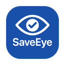

# SaveEye

<p align="center">
  
</p>

<p align="center">
  <b>A simple and efficient eye care reminder app for macOS</b>
</p>

<p align="center">
  
  
  
  <a href="https://deepwiki.com/samzong/SaveEye"></a>
</p>

[English](README.md) | [中文](README_zh.md)

## Features

- **Timed Reminders** - Reminds you to rest your eyes at regular intervals
- **Full-Screen Eye Care** - Forces rest with a full-screen eye care interface during breaks
- **Smart Detection** - Automatically monitors keyboard and mouse activity, pausing the timer when inactive
- **Customizable Settings** - Configure work duration, break duration, and other parameters
- **Minimalist Experience** - Supports auto-launch at startup without occupying Dock or menu bar space
- **Eye-Friendly Design** - Uses dark backgrounds and smooth animations to reduce visual fatigue

## Installation

### Install via Homebrew (Recommended)

```bash
brew tap samzong/tap
brew install saveeye
```

### Manual Installation

1. Download the DMG file for your architecture from the [Releases](https://github.com/samzong/SaveEye/releases) page
2. Drag to Applications folder and run

If you encounter the error `"SaveEye" is damaged and can't be opened. You should move it to the Trash.`, try the following:

1. Open System Preferences -> Security & Privacy -> General -> Allow apps downloaded from
2. Check "Anywhere"
3. Run SaveEye again
4. If it still doesn't work, try running `xattr -d com.apple.quarantine /Applications/SaveEye.app` in Terminal

### Build from Source

```bash
# Clone the project
git clone https://github.com/samzong/SaveEye.git
cd SaveEye

# Build and install in one step
make install-app
```

### Usage Instructions

1. After launching the app, you'll need to grant **Accessibility permissions** on first use
2. Set work duration (default 20 minutes) and break duration (default 20 seconds) in the configuration window
3. Click "Start Protection" to begin the eye care timer
4. When time is up, a full-screen rest reminder will automatically appear. Press ESC to exit

## System Requirements

- macOS 15+
- Accessibility permissions required (for monitoring user activity)

## License

[MIT License](LICENSE)
