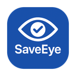

# SaveEye

<p align="center">
  
</p>

<p align="center">
  <b>一个简单高效的 macOS 护眼提醒应用</b>
</p>

<p align="center">
  
  
  
  <a href="https://deepwiki.com/samzong/SaveEye"></a>
</p>

[English](README.md) | [中文](README_zh.md)

## 功能特点

- **定时提醒** - 每隔一段时间提醒你休息眼睛
- **全屏护眼** - 休息时全屏显示护眼界面，强制休息
- **智能检测** - 自动监测键盘鼠标活动，无活动时暂停计时
- **个性设置** - 可自定义工作时长、休息时长等参数
- **极简体验** - 支持开机自启动，不占用 Dock 和菜单栏
- **护眼设计** - 采用深色背景和柔和动画，减少视觉疲劳

## 安装方式

### 通过 Homebrew 安装（推荐）

```bash
brew tap samzong/tap
brew install saveeye
```

### 手动安装

1. 从 [Releases](https://github.com/samzong/SaveEye/releases) 页面下载对应架构的 DMG 文件
2. 拖动到 Applications 文件夹后运行

如果出现 `“SaveEye” is damaged and can’t be opened. You should move it to the Trash.` 的错误，请尝试以下方法：

1. 打开系统偏好设置 -> 安全性与隐私 -> 通用 -> 允许从以下位置下载的 App
2. 勾选“任何来源”
3. 重新运行 SaveEye
4. 如果还是不行，请尝试在终端中运行 `xattr -d com.apple.quarantine /Applications/SaveEye.app`

### 源码编译

```bash
# 克隆项目
git clone https://github.com/samzong/SaveEye.git
cd SaveEye

# 一键构建并安装
make install-app
```

### 使用说明

1. 启动应用后，首次使用需要授予**辅助功能权限**
2. 在配置窗口设置工作时长（默认 20 分钟）和休息时长（默认 20 秒）
3. 点击"开始保护"即可开始护眼计时
4. 到时间后会自动全屏显示休息提醒，按 ESC 键可退出

## 系统要求

- macOS 15+
- 需要辅助功能权限（用于监测用户活动）

## License

[MIT License](LICENSE)
